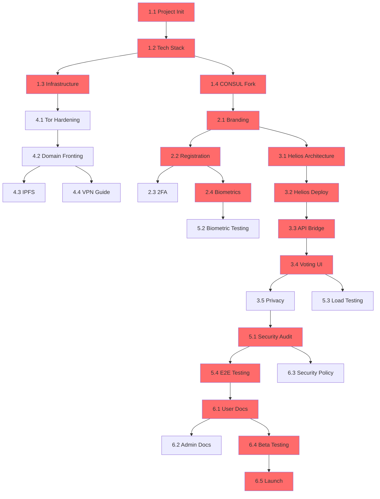

# Digital Democracy Platform - Work Breakdown Structure (WBS)

## Project Overview

**Project Name:** Resilient Grassroots Digital Democracy Platform (Iran)
**Duration:** 12 weeks (3 months) for Phase 1 MVP
**Team Size:** 2-5 (1 expert + 1 beginner + 0-3 volunteers)
**Budget:** <$50K
**Critical Path Duration:** 10 weeks (highlighted below)

---

## WBS Legend

### Node Structure
```
[Node ID] Task Name
├─ Duration: X weeks
├─ Agent Vector: Role(s) responsible
├─ Dependencies: [Node IDs that must complete first]
├─ Deliverable: What gets produced
└─ Critical Path: ⚠️ (if on critical path)
```

### Agent Vectors (Roles)
- **ARCH** - System Architect (Expert)
- **DEV** - Full-Stack Developer (Expert/Beginner + AI)
- **CRYPTO** - Cryptography Specialist (Expert/Volunteer)
- **DEVOPS** - DevOps Engineer (Expert/Volunteer)
- **UX** - UX/UI Designer (Volunteer/AI-assisted)
- **SEC** - Security Specialist (Expert/Volunteer)
- **QA** - Quality Assurance (Beginner + AI)

---

## Phase 1: MVP (Weeks 1-12)

### 🎯 MILESTONE 1: Foundation & Setup (Weeks 1-2)

#### [1.1] Project Initialization ⚠️ CRITICAL PATH
├─ Duration: 3 days
├─ Agent Vector: ARCH + DEV
├─ Dependencies: None
├─ Deliverable: 
│   - GitHub repository (private)
│   - Development environment setup
│   - CI/CD pipeline (GitHub Actions)
│   - Project documentation structure
└─ Tasks:
    - Create repo with .gitignore, README, LICENSE (AGPL-3.0)
    - Set up development containers (Docker)
    - Configure GitHub Actions for automated testing
    - Create project wiki for documentation

#### [1.2] Technology Stack Selection ⚠️ CRITICAL PATH
├─ Duration: 2 days
├─ Agent Vector: ARCH
├─ Dependencies: [1.1]
├─ Deliverable:
│   - Technology decision document
│   - Architecture diagram (high-level)
│   - Dependency list with versions
└─ Tasks:
    - Evaluate CONSUL vs. Decidim (recommend CONSUL for simplicity)
    - Select cryptographic voting library (Helios)
    - Choose biometric libraries (face-api.js)
    - Document rationale for each choice

#### [1.3] Infrastructure Provisioning ⚠️ CRITICAL PATH
├─ Duration: 2 days
├─ Agent Vector: DEVOPS
├─ Dependencies: [1.2]
├─ Deliverable:
│   - VPS server (Hetzner/DigitalOcean)
│   - Tor hidden service configured
│   - PostgreSQL database
│   - SSL certificates
└─ Tasks:
    - Provision VPS outside Iran (Germany/Netherlands)
    - Install and configure Tor
    - Set up PostgreSQL with encryption at rest
    - Configure firewall and security hardening

#### [1.4] CONSUL Platform Fork
├─ Duration: 2 days
├─ Agent Vector: DEV
├─ Dependencies: [1.2]
├─ Deliverable:
│   - Forked CONSUL repository
│   - Local development instance running
│   - Customization plan document
└─ Tasks:
    - Fork CONSUL from GitHub
    - Set up local development environment
    - Run test suite to verify functionality
    - Document customization points

---

### 🎯 MILESTONE 2: Core Platform Customization (Weeks 3-4)

#### [2.1] CONSUL Branding & Localization ⚠️ CRITICAL PATH
├─ Duration: 3 days
├─ Agent Vector: UX + DEV
├─ Dependencies: [1.4]
├─ Deliverable:
│   - Persian (Farsi) language pack
│   - Custom branding (logo, colors)
│   - Simplified UI for general population
└─ Tasks:
    - Translate UI to Persian
    - Create custom theme (CSS)
    - Simplify navigation for non-technical users
    - Add right-to-left (RTL) text support

#### [2.2] User Registration Module ⚠️ CRITICAL PATH
├─ Duration: 5 days
├─ Agent Vector: DEV
├─ Dependencies: [2.1]
├─ Deliverable:
│   - Registration flow with email verification
│   - Social vouching system (2-user approval)
│   - User profile management
└─ Tasks:
    - Build registration form (email, password, basic info)
    - Implement email verification (SMTP)
    - Create vouching system (pending approvals table)
    - Build admin panel for vouching oversight

#### [2.3] Two-Factor Authentication (2FA)
├─ Duration: 2 days
├─ Agent Vector: DEV
├─ Dependencies: [2.2]
├─ Deliverable:
│   - TOTP-based 2FA (Google Authenticator compatible)
│   - QR code generation for setup
│   - Backup codes
└─ Tasks:
    - Integrate TOTP library (rotp gem for Rails)
    - Generate QR codes for authenticator apps
    - Implement backup code system
    - Add 2FA enforcement option

#### [2.4] Biometric Identity Verification ⚠️ CRITICAL PATH
├─ Duration: 7 days
├─ Agent Vector: DEV + SEC
├─ Dependencies: [2.2]
├─ Deliverable:
│   - 2D facial recognition during signup
│   - Liveness detection (blink, smile, turn head)
│   - Face embedding storage (hashed, not raw images)
│   - Duplicate detection system
└─ Tasks:
    - Integrate face-api.js for browser-based face detection
    - Implement liveness challenges (random prompts)
    - Generate face embeddings (128D vectors)
    - Store embeddings with bcrypt hashing
    - Build duplicate detection (cosine similarity threshold)
    - **CRITICAL:** Ensure no raw biometric data leaves device

---

### 🎯 MILESTONE 3: Cryptographic Voting Engine (Weeks 5-7)

#### [3.1] Helios Integration Architecture ⚠️ CRITICAL PATH
├─ Duration: 3 days
├─ Agent Vector: ARCH + CRYPTO
├─ Dependencies: [2.1]
├─ Deliverable:
│   - Integration design document
│   - API specification (CONSUL ↔ Helios)
│   - Data flow diagrams
└─ Tasks:
    - Design API bridge between CONSUL (Rails) and Helios (Django)
    - Define vote lifecycle (creation → casting → tallying)
    - Plan cryptographic key management
    - Document security assumptions

#### [3.2] Helios Deployment ⚠️ CRITICAL PATH
├─ Duration: 4 days
├─ Agent Vector: DEVOPS + CRYPTO
├─ Dependencies: [3.1]
├─ Deliverable:
│   - Helios instance running on server
│   - Election trustee setup
│   - Test election conducted
└─ Tasks:
    - Deploy Helios on same VPS (separate container)
    - Configure election trustees (key holders)
    - Set up ElGamal encryption parameters
    - Run test election with dummy votes

#### [3.3] CONSUL-Helios API Bridge ⚠️ CRITICAL PATH
├─ Duration: 5 days
├─ Agent Vector: DEV
├─ Dependencies: [3.2]
├─ Deliverable:
│   - RESTful API for vote operations
│   - Authentication/authorization layer
│   - Error handling and logging
└─ Tasks:
    - Build Rails API controller for Helios communication
    - Implement vote casting endpoint
    - Add vote verification endpoint
    - Create tallying trigger mechanism
    - Add comprehensive error handling

#### [3.4] Voting UI Components ⚠️ CRITICAL PATH
├─ Duration: 5 days
├─ Agent Vector: UX + DEV
├─ Dependencies: [3.3]
├─ Deliverable:
│   - Vote creation interface (admin)
│   - Vote casting interface (user)
│   - Vote verification interface
│   - Results display
└─ Tasks:
    - Design voting UI (simple yes/no + multiple choice)
    - Build vote creation form (admin panel)
    - Create ballot interface (user-facing)
    - Implement vote verification page (show encrypted vote + receipt)
    - Build results dashboard with charts

#### [3.5] Vote Privacy & Anonymization
├─ Duration: 3 days
├─ Agent Vector: CRYPTO + SEC
├─ Dependencies: [3.4]
├─ Deliverable:
│   - Anonymization layer between identity and votes
│   - Audit log (who voted, not how they voted)
│   - Privacy policy documentation
└─ Tasks:
    - Implement blind signature or similar protocol
    - Separate identity database from vote database
    - Create audit log (timestamps, voter IDs, no vote content)
    - Document privacy guarantees

---

### 🎯 MILESTONE 4: Censorship Resistance (Weeks 6-8)

#### [4.1] Tor Hidden Service Hardening
├─ Duration: 2 days
├─ Agent Vector: DEVOPS + SEC
├─ Dependencies: [1.3]
├─ Deliverable:
│   - Hardened Tor configuration
│   - .onion address published
│   - Tor Browser compatibility tested
└─ Tasks:
    - Configure Tor hidden service with v3 onion address
    - Harden Tor configuration (rate limiting, DoS protection)
    - Test platform access via Tor Browser
    - Create user guide for Tor access

#### [4.2] Domain Fronting Setup
├─ Duration: 3 days
├─ Agent Vector: DEVOPS
├─ Dependencies: [4.1]
├─ Deliverable:
│   - Cloudflare or Azure CDN configured
│   - Domain fronting tested from Iran
│   - Fallback domains registered
└─ Tasks:
    - Set up Cloudflare account with domain fronting
    - Configure CDN to proxy requests to origin server
    - Register multiple fallback domains
    - Test access from Iran (via VPN simulation)

#### [4.3] Content Delivery via IPFS (Optional)
├─ Duration: 4 days
├─ Agent Vector: DEVOPS
├─ Dependencies: [4.2]
├─ Deliverable:
│   - IPFS node running
│   - Static assets served via IPFS
│   - IPFS gateway configured
└─ Tasks:
    - Install and configure IPFS node
    - Upload static assets (CSS, JS, images) to IPFS
    - Configure IPFS gateway
    - Update platform to load assets from IPFS

#### [4.4] VPN/Proxy Recommendations
├─ Duration: 1 day
├─ Agent Vector: SEC
├─ Dependencies: [4.2]
├─ Deliverable:
│   - User guide for VPN/proxy setup
│   - Recommended tools list (Psiphon, Lantern, Snowflake)
└─ Tasks:
    - Research censorship circumvention tools
    - Create step-by-step guides (Persian + English)
    - Test recommended tools from Iran (via VPN)

---

### 🎯 MILESTONE 5: Security & Testing (Weeks 9-10)

#### [5.1] Security Audit (Internal) ⚠️ CRITICAL PATH
├─ Duration: 5 days
├─ Agent Vector: SEC + ARCH
├─ Dependencies: [3.5], [4.2]
├─ Deliverable:
│   - Security audit report
│   - Vulnerability remediation plan
│   - Penetration testing results
└─ Tasks:
    - Conduct code review for common vulnerabilities (OWASP Top 10)
    - Test for SQL injection, XSS, CSRF
    - Verify cryptographic implementation
    - Check for information leakage
    - Test authentication/authorization bypasses

#### [5.2] Biometric Security Testing
├─ Duration: 3 days
├─ Agent Vector: SEC + DEV
├─ Dependencies: [2.4]
├─ Deliverable:
│   - Biometric spoofing test results
│   - Liveness detection effectiveness report
│   - Recommendations for improvements
└─ Tasks:
    - Test face recognition with photos (should fail)
    - Test face recognition with videos (should fail)
    - Test face recognition with masks/disguises
    - Verify liveness detection effectiveness
    - Test duplicate detection accuracy

#### [5.3] Load Testing
├─ Duration: 2 days
├─ Agent Vector: QA + DEVOPS
├─ Dependencies: [3.4]
├─ Deliverable:
│   - Load testing report
│   - Performance bottlenecks identified
│   - Scaling recommendations
└─ Tasks:
    - Simulate 1,000 concurrent users
    - Test vote casting under load
    - Measure response times
    - Identify database query bottlenecks
    - Recommend caching strategies

#### [5.4] End-to-End Testing ⚠️ CRITICAL PATH
├─ Duration: 4 days
├─ Agent Vector: QA + DEV
├─ Dependencies: [5.1]
├─ Deliverable:
│   - Automated test suite
│   - Test coverage report (>80%)
│   - Bug tracking system
└─ Tasks:
    - Write integration tests (RSpec for Rails)
    - Test complete user journeys (registration → voting → verification)
    - Test edge cases and error conditions
    - Set up continuous testing in CI/CD
    - Document known issues and workarounds

---

### 🎯 MILESTONE 6: Documentation & Launch Prep (Weeks 11-12)

#### [6.1] User Documentation ⚠️ CRITICAL PATH
├─ Duration: 3 days
├─ Agent Vector: UX + DEV
├─ Dependencies: [5.4]
├─ Deliverable:
│   - User guide (Persian + English)
│   - Video tutorials
│   - FAQ
└─ Tasks:
    - Write step-by-step user guide
    - Create video tutorials (screen recordings)
    - Build FAQ section
    - Translate all documentation to Persian

#### [6.2] Administrator Documentation
├─ Duration: 2 days
├─ Agent Vector: ARCH + DEV
├─ Dependencies: [6.1]
├─ Deliverable:
│   - Admin manual
│   - Deployment guide
│   - Troubleshooting guide
└─ Tasks:
    - Document admin panel features
    - Write deployment/upgrade procedures
    - Create troubleshooting guide
    - Document backup/recovery procedures

#### [6.3] Security & Privacy Policy
├─ Duration: 2 days
├─ Agent Vector: SEC + ARCH
├─ Dependencies: [5.1]
├─ Deliverable:
│   - Privacy policy
│   - Security whitepaper
│   - Threat model document
└─ Tasks:
    - Write privacy policy (what data is collected, how it's used)
    - Create security whitepaper (cryptographic protocols)
    - Document threat model and mitigations
    - Publish transparency report template

#### [6.4] Beta Testing Program ⚠️ CRITICAL PATH
├─ Duration: 5 days
├─ Agent Vector: ALL
├─ Dependencies: [6.1]
├─ Deliverable:
│   - 50 beta users registered
│   - 5 test votes conducted
│   - Feedback collected and prioritized
└─ Tasks:
    - Recruit 50 beta testers (trusted community members)
    - Conduct onboarding sessions
    - Run 5 test votes (various types)
    - Collect feedback via surveys
    - Prioritize bug fixes and improvements

#### [6.5] Launch Preparation ⚠️ CRITICAL PATH
├─ Duration: 3 days
├─ Agent Vector: ALL
├─ Dependencies: [6.4]
├─ Deliverable:
│   - Production environment ready
│   - Monitoring and alerting configured
│   - Incident response plan
│   - Launch announcement
└─ Tasks:
    - Finalize production configuration
    - Set up monitoring (Grafana + Prometheus)
    - Configure alerting (email/Telegram)
    - Write incident response plan
    - Prepare launch announcement (social media, forums)

---

## Critical Path Analysis

### Critical Path (10 weeks)
```
[1.1] → [1.2] → [1.3] → [1.4] → [2.1] → [2.2] → [2.4] → 
[3.1] → [3.2] → [3.3] → [3.4] → [5.1] → [5.4] → [6.1] → [6.4] → [6.5]
```

### Critical Path Duration: 10 weeks
- Week 1: [1.1] + [1.2] + [1.3]
- Week 2: [1.4] + [2.1]
- Week 3: [2.2]
- Week 4: [2.4]
- Week 5: [3.1] + [3.2]
- Week 6: [3.3]
- Week 7: [3.4]
- Week 9: [5.1]
- Week 10: [5.4]
- Week 11: [6.1]
- Week 12: [6.4] + [6.5]

### Parallel Work Streams
- **Stream A (Critical):** Platform core + voting engine
- **Stream B (Parallel):** Censorship resistance (Weeks 6-8)
- **Stream C (Parallel):** Security testing (Weeks 9-10)

### Slack Time (Non-Critical Tasks)
- [2.3] 2FA: 2 days slack
- [3.5] Privacy: 3 days slack
- [4.1-4.4] Censorship resistance: Can run parallel to voting engine
- [5.2-5.3] Testing: Can run parallel to security audit
- [6.2-6.3] Documentation: Can run parallel to user docs

---

## Resource Allocation

### Week-by-Week Breakdown

**Weeks 1-2: Setup**
- ARCH: 100% (leading setup)
- DEV: 100% (infrastructure + fork)
- DEVOPS: 50% (infrastructure)

**Weeks 3-4: Platform Customization**
- DEV: 100% (registration + biometrics)
- UX: 50% (branding + localization)
- SEC: 25% (biometric security review)

**Weeks 5-7: Voting Engine**
- CRYPTO: 100% (Helios integration)
- DEV: 100% (API bridge + UI)
- ARCH: 25% (architecture review)

**Weeks 6-8: Censorship Resistance (Parallel)**
- DEVOPS: 100% (Tor + domain fronting + IPFS)
- SEC: 25% (VPN recommendations)

**Weeks 9-10: Security & Testing**
- SEC: 100% (security audit)
- QA: 100% (testing)
- DEV: 50% (bug fixes)

**Weeks 11-12: Documentation & Launch**
- ALL: 100% (documentation + beta testing + launch)

---

## Dependencies Graph



**Legend:** Red nodes = Critical Path

---

## Risk Register

### High-Priority Risks

| Risk ID | Description | Probability | Impact | Mitigation | Owner |
|---------|-------------|-------------|--------|------------|-------|
| R1 | Helios integration more complex than expected | High | High | Allocate extra time; consider simpler crypto library | CRYPTO |
| R2 | Biometric duplicate detection has false positives | Medium | High | Tune similarity threshold; manual review process | SEC |
| R3 | Tor access blocked in Iran | Medium | Critical | Implement domain fronting; provide VPN guides | DEVOPS |
| R4 | Team capacity insufficient (2 people) | High | High | Recruit volunteers; use AI assistance heavily | ARCH |
| R5 | Budget overrun (hosting costs) | Medium | Medium | Use free tiers; optimize resource usage | DEVOPS |
| R6 | Security vulnerability discovered post-launch | Medium | Critical | Bug bounty program; rapid response plan | SEC |
| R7 | User adoption low (social vouching barrier) | Medium | High | Seed initial users; simplify vouching process | ALL |
| R8 | Government targets platform/developers | Low | Critical | Anonymous development; decentralized hosting | ALL |

---

## Budget Breakdown

### Infrastructure (Monthly)
- VPS (8GB RAM, 4 CPU): $20/month × 3 months = $60
- Domain registration: $15/year
- SSL certificates: $0 (Let's Encrypt)
- Cloudflare Pro (optional): $20/month × 3 months = $60
- **Total Infrastructure:** $135

### Development Tools
- GitHub (free for open source)
- GitHub Copilot: $10/month × 3 months = $30
- Design tools (Figma free tier): $0
- **Total Tools:** $30

### Services
- Email (SendGrid free tier): $0
- Monitoring (self-hosted): $0
- **Total Services:** $0

### Contingency
- Bug bounty (post-launch): $500
- Emergency hosting: $200
- **Total Contingency:** $700

### **TOTAL PHASE 1 BUDGET:** $865

**Remaining budget for Phase 2+:** ~$49,000

---

## Success Criteria

### Phase 1 MVP (Week 12)
- [ ] Platform accessible via Tor and domain fronting
- [ ] 100 users registered with social vouching
- [ ] 10 successful votes conducted (various types)
- [ ] Zero vote tampering incidents
- [ ] <5 second vote submission time
- [ ] >80% test coverage
- [ ] Security audit completed with no critical vulnerabilities
- [ ] User documentation in Persian and English
- [ ] Beta testing feedback incorporated

### Technical Metrics
- [ ] 99% uptime during beta period
- [ ] <2 second page load time
- [ ] <0.1% biometric false positive rate
- [ ] 100% vote verifiability (users can check their encrypted votes)

### Security Metrics
- [ ] No successful attacks during beta
- [ ] No biometric data leakage
- [ ] No vote-identity linkage possible
- [ ] Tor access functional from Iran

---

## Phase 2+ Roadmap (Weeks 13-24)

### Phase 2: Decentralization (Weeks 13-18)
- [7.1] IPFS full integration (content + metadata)
- [7.2] Blockchain audit trail (Ethereum or Hyperledger)
- [7.3] Mesh networking (Briar/Scuttlebutt integration)
- [7.4] Offline voting with sync
- [7.5] Mobile apps (React Native)

### Phase 3: Advanced Features (Weeks 19-30)
- [8.1] 3D facial recognition + voice biometrics
- [8.2] Advanced voting methods (ranked choice, quadratic, liquid democracy)
- [8.3] Geo-restricted voting
- [8.4] Live advocacy (dynamic representatives)
- [8.5] DAO governance implementation

### Phase 4: Scale & Hardening (Weeks 31-52)
- [9.1] Custom blockchain (Tendermint or Substrate)
- [9.2] Full P2P architecture (no central server)
- [9.3] Advanced cryptographic protocols (zk-SNARKs)
- [9.4] External security audit (professional firm)
- [9.5] Scale to 10,000+ users

---

## Gantt Chart (Phase 1)

```
Week  | 1  | 2  | 3  | 4  | 5  | 6  | 7  | 8  | 9  | 10 | 11 | 12 |
------|----|----|----|----|----|----|----|----|----|----|----|----|
1.1   |█   |    |    |    |    |    |    |    |    |    |    |    |
1.2   |█   |    |    |    |    |    |    |    |    |    |    |    |
1.3   | █  |    |    |    |    |    |    |    |    |    |    |    |
1.4   | █  |    |    |    |    |    |    |    |    |    |    |    |
2.1   |  █ |    |    |    |    |    |    |    |    |    |    |    |
2.2   |    |█   |    |    |    |    |    |    |    |    |    |    |
2.3   |    | █  |    |    |    |    |    |    |    |    |    |    |
2.4   |    |  █ |█   |    |    |    |    |    |    |    |    |    |
3.1   |    |    |    |█   |    |    |    |    |    |    |    |    |
3.2   |    |    |    | █  |    |    |    |    |    |    |    |    |
3.3   |    |    |    |  █ |█   |    |    |    |    |    |    |    |
3.4   |    |    |    |    | █  |█   |    |    |    |    |    |    |
3.5   |    |    |    |    |    | █  |    |    |    |    |    |    |
4.1   |    |    |    |    |    |█   |    |    |    |    |    |    |
4.2   |    |    |    |    |    | █  |    |    |    |    |    |    |
4.3   |    |    |    |    |    |  █ |█   |    |    |    |    |    |
4.4   |    |    |    |    |    |    | █  |    |    |    |    |    |
5.1   |    |    |    |    |    |    |    |█   |█   |    |    |    |
5.2   |    |    |    |    |    |    |    | █  |    |    |    |    |
5.3   |    |    |    |    |    |    |    |  █ |    |    |    |    |
5.4   |    |    |    |    |    |    |    |    | █  |█   |    |    |
6.1   |    |    |    |    |    |    |    |    |    | █  |    |    |
6.2   |    |    |    |    |    |    |    |    |    |  █ |    |    |
6.3   |    |    |    |    |    |    |    |    |    |  █ |    |    |
6.4   |    |    |    |    |    |    |    |    |    |    |█   |█   |
6.5   |    |    |    |    |    |    |    |    |    |    |    | █  |

█ = Critical Path
█ = Non-Critical Path
```

---

## Next Steps

1. **Review WBS with team** - Validate timeline and resource allocation
2. **Set up project management** - Use GitHub Projects or Trello
3. **Begin Week 1 tasks** - Start with [1.1] Project Initialization
4. **Weekly standups** - Review progress, adjust timeline as needed
5. **Risk monitoring** - Track risks and update mitigation strategies

---

## Conclusion

This WBS provides a realistic 12-week path to a working MVP. The critical path is 10 weeks, with 2 weeks of buffer for unexpected delays. Success requires:

1. **Disciplined scope management** - No feature creep
2. **Parallel work streams** - Maximize team efficiency
3. **Heavy use of existing tools** - Don't reinvent the wheel
4. **AI-assisted development** - Leverage Copilot, ChatGPT, Claude
5. **Community engagement** - Recruit volunteers for non-critical tasks

**The platform will be functional, secure, and censorship-resistant - but not feature-complete. Phases 2-4 add advanced capabilities over the following 9 months.**

Ready to begin implementation?
