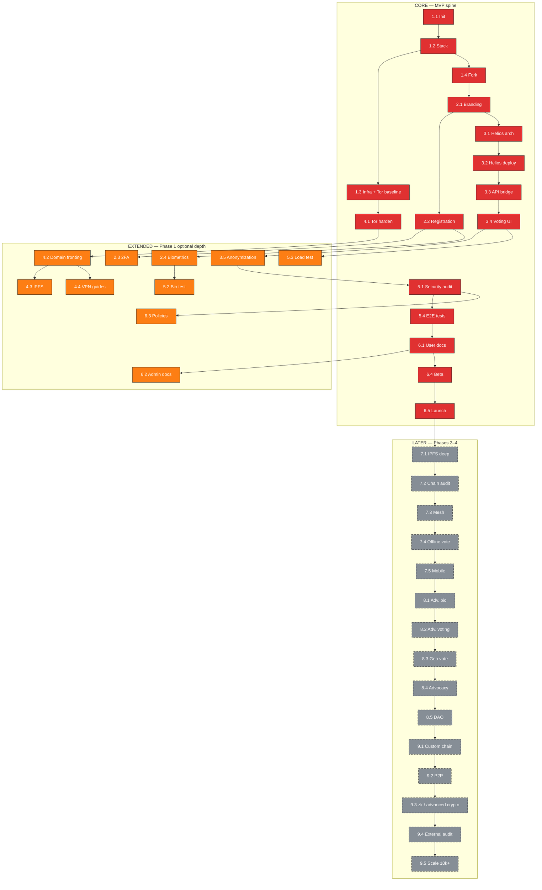

# Digital Democracy Platform — Work Breakdown Structure (Extensive)

This document is the **single master plan**: it lists **all** planned work from Phase 1 through Phase 4. Items are tagged by **integration tier** so you can **focus on the minimum viable path** while keeping later work visible (and **dimmed** in the dashboard graph).

---

## Project overview

| Field | Value |
|--------|--------|
| **Project** | Resilient Grassroots Digital Democracy Platform (Iran) |
| **This document** | Extensive WBS (Phase 1–4); **Core** = first shippable slice |
| **Phase 1 calendar** | 12 weeks (MVP window) |
| **Team** | 2–5 (1 expert + 1 beginner + 0–3 volunteers) |
| **Budget envelope** | \<$50K (see cost note in Budget section) |

---

## Integration tiers (how to read tags)

| Tag | Meaning | When it ships |
|-----|---------|----------------|
| **CORE** | Required for the **first coherent MVP**: forked platform, registration, cryptographic voting path, baseline Tor access, internal security review, E2E tests, user docs, beta, launch. | Phase 1 — gate for “we can run a real test vote stack.” |
| **EXTENDED** | Still **Phase 1 full vision**; valuable but **deferrable** if you need to cut weeks: 2FA, full biometrics, vote anonymization hardening, domain fronting, IPFS, VPN guides, focused biometric/load tests, admin + policy depth. | Same phase as CORE, but **optional for first gate**. |
| **LATER** | **Post-MVP integration** (your prior Phases 2–4): deeper decentralization, advanced biometrics/voting, scale, external audit. | After Phase 1 launch or parallel if capacity appears. |

**Dashboard / graph:** In `project-dashboard-web`, **dimming** applies **EXTENDED** and **LATER** so the **CORE** spine stays visually dominant. Toggle **“Dim extended & later”** to see the full extensive plan at equal emphasis.

**Dependency rule of thumb:** If you defer **EXTENDED** packages, **remove or relax any CORE task that still depends on them** (e.g. launch prep should not block on optional IPFS). The dashboard data aligns **production finalization** with **Tor baseline**, not IPFS-only paths.

---

## Master register — all work packages

Work packages **1.x–6.x** = Phase 1. **7.x–9.x** = former roadmap, now first-class rows in the same register.

| ID | Name | Tier | Primary agents |
|----|------|------|----------------|
| 1.1 | Project Initialization | CORE | ARCH + DEV |
| 1.2 | Technology Stack Selection | CORE | ARCH (+ CRYPTO input) |
| 1.3 | Infrastructure Provisioning | CORE | DEVOPS |
| 1.4 | CONSUL Platform Fork | CORE | DEV |
| 2.1 | CONSUL Branding & Localization | CORE | UX + DEV |
| 2.2 | User Registration Module | CORE | DEV |
| 2.3 | Two-Factor Authentication (2FA) | EXTENDED | DEV |
| 2.4 | Biometric Identity Verification | EXTENDED | DEV + SEC |
| 3.1 | Helios Integration Architecture | CORE | ARCH + CRYPTO |
| 3.2 | Helios Deployment | CORE | DEVOPS + CRYPTO |
| 3.3 | CONSUL–Helios API Bridge | CORE | DEV |
| 3.4 | Voting UI Components | CORE | UX + DEV |
| 3.5 | Vote Privacy & Anonymization | EXTENDED | CRYPTO + SEC |
| 4.1 | Tor Hidden Service Hardening | CORE | DEVOPS + SEC |
| 4.2 | Domain Fronting Setup | EXTENDED | DEVOPS |
| 4.3 | Content Delivery via IPFS | EXTENDED | DEVOPS |
| 4.4 | VPN/Proxy Recommendations | EXTENDED | SEC + UX |
| 5.1 | Security Audit (Internal) | CORE | SEC + ARCH |
| 5.2 | Biometric Security Testing | EXTENDED | SEC + DEV |
| 5.3 | Load Testing | EXTENDED | QA + DEVOPS |
| 5.4 | End-to-End Testing | CORE | QA + DEV |
| 6.1 | User Documentation | CORE | UX + DEV |
| 6.2 | Administrator Documentation | EXTENDED | ARCH + DEV |
| 6.3 | Security & Privacy Policy | EXTENDED | SEC + ARCH |
| 6.4 | Beta Testing Program | CORE | ALL |
| 6.5 | Launch Preparation | CORE | ALL |
| 7.1 | IPFS — full content + metadata integration | LATER | DEVOPS + DEV |
| 7.2 | Blockchain audit trail | LATER | CRYPTO + DEV |
| 7.3 | Mesh networking (e.g. Briar / Scuttlebutt exploration) | LATER | ARCH + DEV |
| 7.4 | Offline voting with sync | LATER | CRYPTO + DEV |
| 7.5 | Mobile apps (e.g. React Native) | LATER | DEV + UX |
| 8.1 | Advanced biometrics (3D face + voice, roadmap) | LATER | DEV + SEC |
| 8.2 | Advanced voting methods (ranked choice, quadratic, liquid) | LATER | ARCH + DEV |
| 8.3 | Geo-restricted voting | LATER | DEV + SEC |
| 8.4 | Live advocacy / dynamic representatives | LATER | DEV + UX |
| 8.5 | DAO governance implementation | LATER | ARCH + CRYPTO |
| 9.1 | Custom blockchain (e.g. Tendermint / Substrate) | LATER | CRYPTO + DEV |
| 9.2 | Full P2P architecture (no central server) | LATER | ARCH + DEV |
| 9.3 | Advanced cryptography (e.g. zk-SNARKs) | LATER | CRYPTO |
| 9.4 | External security audit (professional firm) | LATER | SEC + ALL |
| 9.5 | Scale to 10,000+ users | LATER | DEVOPS + DEV |

---

## CORE dependency path (minimum spine)

Logical order for **CORE** only (EXTENDED/LATER nodes omitted):

```
1.1 → 1.2 → 1.3 ─────────────────────────────┐
         └→ 1.4 → 2.1 → 2.2 → 3.1 → 3.2 → 3.3 → 3.4
                              ↑ (parallel from 1.3)
4.1 (Tor hardening; parallel once 1.3 exists)
→ 5.1 (after voting stack + 4.2 not required if EXTENDED cut)
→ 5.4 → 6.1 → 6.4 → 6.5
```

**Note:** If you keep **3.5** or **5.1** strictly coupled, treat **3.5** as strongly recommended before declaring “vote privacy complete”; on the **tier** model it remains **EXTENDED** so teams can time-box MVP and add anonymization hardening immediately after first internal election.

---

## Phase 1 — detailed packages (extensive)

### MILESTONE 1: Foundation & Setup (Weeks 1–2)

#### [1.1] Project Initialization — **CORE** ⚠️ critical path
- Repo (private), dev environment, CI/CD, documentation structure.

#### [1.2] Technology Stack Selection — **CORE** ⚠️ critical path
- CONSUL vs Decidim, Helios, biometric libraries, written rationale.

#### [1.3] Infrastructure Provisioning — **CORE** ⚠️ critical path
- VPS (outside target jurisdiction), PostgreSQL, SSL, **Tor hidden service baseline**.

#### [1.4] CONSUL Platform Fork — **CORE** ⚠️ critical path
- Fork, local instance, customization plan, tests green.

---

### MILESTONE 2: Core Platform Customization (Weeks 3–5)

#### [2.1] CONSUL Branding & Localization — **CORE** ⚠️ critical path
- Persian UI, RTL, theme, simplified navigation.

#### [2.2] User Registration Module — **CORE** ⚠️ critical path
- Email registration, verification, social vouching, admin oversight.

#### [2.3] Two-Factor Authentication — **EXTENDED**
- TOTP, QR setup, backup codes, optional enforcement.

#### [2.4] Biometric Identity Verification — **EXTENDED** ⚠️ (full Phase 1 vision)
- Browser-side biometrics, liveness, embeddings, duplicate detection, **no raw biometrics exfiltration**.

---

### MILESTONE 3: Cryptographic Voting Engine (Weeks 5–8)

#### [3.1] Helios Integration Architecture — **CORE** ⚠️ critical path
- Rails ↔ Helios bridge design, vote lifecycle, key-management plan.

#### [3.2] Helios Deployment — **CORE** ⚠️ critical path
- Deploy Helios, trustees, parameters, test election.

#### [3.3] CONSUL–Helios API Bridge — **CORE** ⚠️ critical path
- REST operations, auth, errors, logging.

#### [3.4] Voting UI Components — **CORE** ⚠️ critical path
- Admin ballot creation, casting UI, verification, results.

#### [3.5] Vote Privacy & Anonymization — **EXTENDED**
- Identity–vote separation, audit logs without ballot content, policy alignment.

---

### MILESTONE 4: Censorship Resistance (Weeks 6–8, parallel)

#### [4.1] Tor Hidden Service Hardening — **CORE**
- v3 onion, hardening, Tor Browser checks, user guide.

#### [4.2] Domain Fronting Setup — **EXTENDED**
- CDN / fronting experiments; validate empirically (availability varies by provider/region).

#### [4.3] Content Delivery via IPFS — **EXTENDED**
- Node, static assets, gateway — optional acceleration of censorship resistance.

#### [4.4] VPN/Proxy Recommendations — **EXTENDED**
- User-facing guides (Persian/English), tool list, safer defaults.

---

### MILESTONE 5: Security & Testing (Weeks 9–10)

#### [5.1] Security Audit (Internal) — **CORE** ⚠️ critical path
- OWASP-style review, crypto checks, authz/authn, leakage.

#### [5.2] Biometric Security Testing — **EXTENDED**
- Spoofing, liveness effectiveness, duplicate metrics.

#### [5.3] Load Testing — **EXTENDED**
- Concurrency, vote path, DB hotspots, caching notes.

#### [5.4] End-to-End Testing — **CORE** ⚠️ critical path
- Journeys registration → vote → verify; CI integration.

---

### MILESTONE 6: Documentation & Launch (Weeks 11–12)

#### [6.1] User Documentation — **CORE** ⚠️ critical path
- Guides, FAQ, tutorials (Persian + English).

#### [6.2] Administrator Documentation — **EXTENDED**
- Admin manual, deploy/upgrade, troubleshooting, backup/restore.

#### [6.3] Security & Privacy Policy — **EXTENDED**
- Privacy policy, security whitepaper draft, threat model, transparency template.

#### [6.4] Beta Testing Program — **CORE** ⚠️ critical path
- Testers, test votes, feedback loop.

#### [6.5] Launch Preparation — **CORE** ⚠️ critical path
- Production config, monitoring, incident response, announcement.

---

## Phases 2–4 — integrate later (same WBS, **LATER** tier)

These were previously in an appendix; they are **part of the extensive main list** above. Summary intent:

- **Phase 2 (7.x):** Decentralization and mobility — IPFS depth, on-chain audit trail, mesh exploration, offline sync, mobile clients.
- **Phase 3 (8.x):** Advanced participation — stronger biometrics, richer voting methods, geo rules, advocacy features, DAO-style governance.
- **Phase 4 (9.x):** Hardening at scale — custom chain / P2P, advanced crypto, **paid external audit**, 10k+ user scaling.

Each **7.x–9.x** package should start only after **explicit go/no-go** from Phase 1 (security, legal, operational safety for organizers).

---

## Full dependency graph (extensive)

**Legend (Mermaid):** red = CORE, orange = EXTENDED, gray dashed = LATER. Edges show **logical** predecessor relationships; parallel work (e.g. 4.x alongside 3.x) still branches from **1.3** / **2.1** as in your original plan.



---

## Critical path (full Phase 1 vision — includes EXTENDED where marked critical in planning)

If you execute **all** Phase 1 packages on the **original** aggressive schedule, the **longest chain** still runs through **biometrics** and **Helios**. For **CORE-only** planning, **drop 2.4, 3.5, 4.2–4.4, 5.2–5.3, 6.2–6.3** from the critical narrative and adjust staffing accordingly.

**Original-style critical sequence (reference):**  
`1.1 → 1.2 → 1.3 → 1.4 → 2.1 → 2.2 → 2.4 → 3.1 → 3.2 → 3.3 → 3.4 → 5.1 → 5.4 → 6.1 → 6.4 → 6.5`

---

## Parallel work streams

| Stream | Contents |
|--------|-----------|
| **A — Platform + voting** | 1.x → 2.x → 3.x (CORE + selected EXTENDED) |
| **B — Censorship** | 4.x from 1.3 onward |
| **C — Assurance** | 5.x after voting features exist |
| **D — Post-MVP** | 7.x → 9.x after 6.5 |

---

## Risk register (unchanged priorities; tie to tiers)

| ID | Risk | Tier link |
|----|------|-----------|
| R1 | Helios integration harder than estimate | CORE — buffer or cut EXTENDED first |
| R2 | Biometric false positives/negatives | EXTENDED — tune or delay 2.4 |
| R3 | Tor blocked | CORE mitigation + EXTENDED 4.2/4.4 |
| R4 | 2-person team capacity | Cut EXTENDED, defer LATER |
| R5 | Hosting cost | DEVOPS — LATER scale drives cost |
| R6 | Post-launch vuln | CORE IR plan; **LATER** 9.4 external audit |
| R7 | Low adoption (vouching) | CORE product + comms |
| R8 | Targeting of operators | CORE opsec; **LATER** 9.2 decentralization |

---

## Budget note

Infrastructure line items can stay low for Phase 1; **labor** dominates. Treat **\<$50K** as **total envelope** including stipends, infra, tools, and **reserve for 9.4** if you commit to an external audit later. The register does not replace finance tracking.

---

## Success criteria (tier-aware)

**CORE MVP gate**

- [ ] Platform reachable via **Tor** (baseline from 1.3 / 4.1)
- [ ] Registration + **at least one** end-to-end **verifiable** vote flow (Helios path)
- [ ] Internal security review complete; **no unresolved criticals** you self-assign
- [ ] E2E tests cover main journey; documentation for users (Persian + English)
- [ ] Beta completed; launch checklist executed

**EXTENDED additions (full Phase 1 vision)**

- [ ] 2FA; biometrics per spec; 3.5 anonymization; optional IPFS/fronting/guides; deeper tests; admin + policy set

**LATER (roadmap)**

- [ ] Items in **7.x–9.x** per community capacity and safety review

---

## Next steps

1. Use **master register** for backlog and issue mapping.  
2. In the dashboard, enable **dimming** to steer standups on **CORE**.  
3. When deferring an **EXTENDED** package, **edit dependencies** in `project-dashboard-web/data.js` so no CORE task waits on dimmed work.  
4. Revisit **LATER** packages after **6.5** retrospective.

---

*This file supersedes the previous “short WBS + appendix” split: the **extensive list is primary**; **tiers** replace hiding later work in a separate section.*
